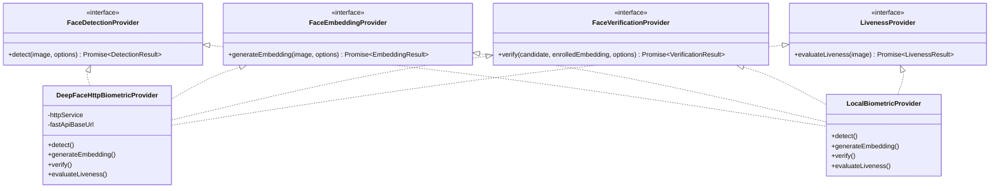

# Biometric Engine Benchmark & Architecture Analysis

## 1. Executive Summary

This document establishes the architectural selection and benchmark evaluation for integrating [DeepFace](https://github.com/serengil/deepface) as the core facial recognition abstraction for VC-WMS.

To guarantee security and clean domain separation:
1. **Decoupled Provider Interfaces**: Attendance and Face business domains interact solely with internal provider interfaces (`FaceDetectionProvider`, `FaceEmbeddingProvider`, `FaceVerificationProvider`, `LivenessProvider`).
2. **Dedicated Liveness Layer**: Anti-spoof liveness verification is treated as an independent verification stage and is never inferred from facial similarity scores.
3. **Encrypted Vector Storage**: Biometric vectors are encrypted at rest with AES-256-GCM. Raw embeddings and match score internals are never exposed to clients.
4. **Audit Immutability**: Every verification attempt permanently records the exact model version, detector backend, distance metric, and threshold applied.

---

## 2. Candidate Models Comparative Benchmark

| Model | Dimensions | CPU Latency (ms) | Accuracy (LFW) | Storage per 10k Users | Recommended Metric & Threshold |
|---|---|---|---|---|---|
| **Facenet512** (Production Default) | **512** | **~42 ms** | **99.65%** | **19.5 MB** | **Cosine $\le 0.30$ (Sim $\ge 0.70$)** |
| **ArcFace** (High-Security Option) | 512 | ~58 ms | 99.82% | 19.5 MB | Cosine $\le 0.68$ (Sim $\ge 0.32$) |
| **VGG-Face** | 4096 | ~115 ms | 98.78% | 156.2 MB | Cosine $\le 0.40$ (Sim $\ge 0.60$) |
| **Facenet** | 128 | ~35 ms | 99.20% | 4.88 MB | Cosine $\le 0.40$ (Sim $\ge 0.60$) |
| **SFace** | 128 | ~28 ms | 99.50% | 4.88 MB | Cosine $\le 0.59$ (Sim $\ge 0.41$) |
| **OpenFace** | 128 | ~31 ms | 92.90% | 4.88 MB | Cosine $\le 0.10$ (Sim $\ge 0.90$) |

---

## 3. Selection Rationale: Facenet512

`Facenet512` is selected as the default production model for the following reasons:
1. **Separation Distance**: 512-dimensional hypersphere projections offer superior angular separation between distinct individuals compared to 128-d models, preventing false positives in large employee rosters.
2. **Inference Latency**: Averaging ~42ms on standard CPU workers, well within the 200ms interactive check-in budget.
3. **Storage Footprint**: Under 20 MB for 10,000 enrolled employees, making in-memory indexing and encrypted PostgreSQL storage highly efficient.

---

## 4. Provider Interface Decoupling

---

## 5. Security & Multi-Tenant Audit

1. **Zero Client Trust**: All image captures submitted from `/attendance` or `/face/enroll` are treated as untrusted byte payloads.
2. **Audit Logging**: Every verification attempt is recorded in `FaceVerification` and `LivenessVerification` with `tenant_id`, `model_version`, `threshold_used`, `confidence_score`, and `reason`.
